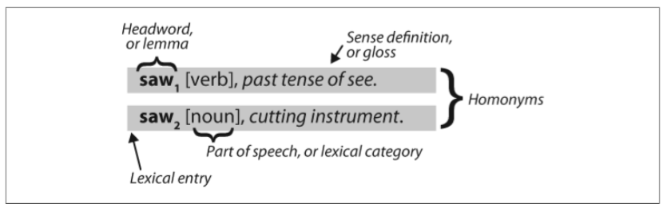
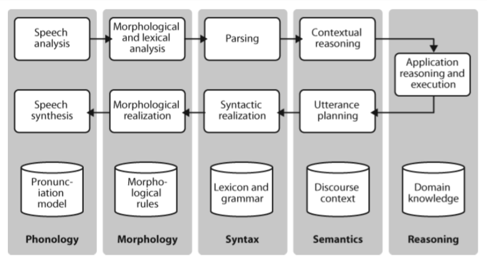
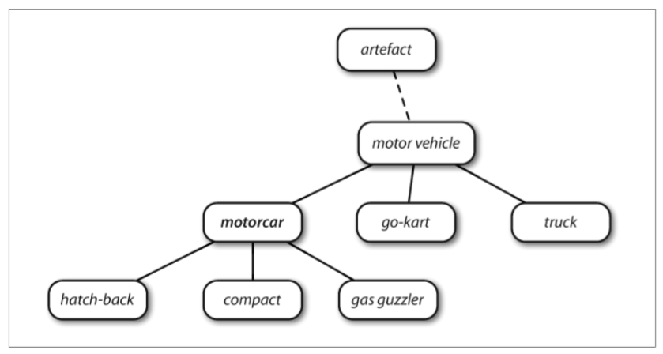
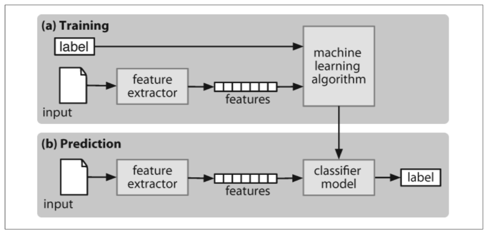

# Natural Language Processing Notes

## NLTK Basics

### Setting Up

```python
import nltk
nltk.download()
from nltk.book import *
from nltk.corpus import wordnet as wn
```

## Technical Terms
1. **Token** is a sequence of characters treated as a group (ie. words).
2. **Word Type** is the form or spelling of the word independently of its specific occurrences in a text.
3. **Hapaxes** are words that occur only once.
4. **Collocation** sequence of words that occur together unusually often.  Resistant to substitution with words that have similar sense (e.g. 'red wine' vs 'maroon winej')
5. **Bigrams** is a list of word pairs.  Word groups are **N-grams**.
6. **Text alignment** - pair up sentences between a bilingual document to detect crresponding words/phrases and build translation model.
7. **Stylistics** is a study of systematic differences between genres.
8. **Lexical Resource** is a collection of words and/or phrases along with associated information, such as part-of-speech and sense definitions. Lexical resources are secondary to texts, and are usually created and enriched with the help of texts.
  - A lexical entry consists of a **headword** (also known as a **lemma**) along with additional information 
9. **Stopwords** are high-frequency words that we want to filter out of a document before further processing.  A type of **wordlist**

## Statistical Language Models

### Frequency Distribution

**Frequency Distribution** tells the frequency of each word in the text.

```python
fdist1 = FreqDist(text1)
fdist1
# <FreqDist with 260819 outcomes>

vocabulary1 = fdist1.keys() >>> vocabulary1[:50]
# [',', 'the', '.', 'of', 'and', 'a', 'to', ';', 'in', 'that', "'", '-', 'his', 'it', 'I', 's', 'is', 'he', 'with', 'was', 'as', '"', 'all', 'for', 'this', '!', 'at', 'by', 'but', 'not', '--', 'him', 'from', 'be', 'on', 'so', 'whale', 'one', 'you', 'had', 'have', 'there', 'But', 'or', 'were', 'now', 'which', '?', 'me', 'like']

fdist1['whale']
# 906
```

#### Finding Specific Words
This means “the set of all w such that w is an element of V (the vocabulary) and w has property P.”

1. {w|w ∈ V & P(w)}
2. [w for w in V if p(w)]

##### For each word w in the vocabulary V, check whether len(w) is greater than 15; all other words will be ignored.
```python
V = set(text1)
long_words = [w for w in V if len(w) > 15]
sorted(long_words)

# ['CIRCUMNAVIGATION', 'Physiognomically', 'apprehensiveness', 'cannibalistically', 'characteristically', 'circumnavigating', 'circumnavigation', 'circumnavigations', 'comprehensiveness', 'hermaphroditical', 'indiscriminately', 'indispensableness', 'irresistibleness', 'physiognomically', 'preternaturalness', 'responsibilities', 'simultaneousness', 'subterraneousness', 'supernaturalness', 'superstitiousness', 'uncomfortableness', 'uncompromisedness', 'undiscriminating', 'uninterpenetratingly']
```

##### Search words longer than seven characters, that occur more than seven times
```python
fdist5 = FreqDist(text5)
sorted([w for w in set(text5) if len(w) > 7 and fdist5[w] > 7])
```

##### Find words that contain 'cie' or 'cei'
```python
tricky = sorted([w for w in set(text2) if 'cie' in w or 'cei' in w])
for word in tricky:
  print(word)
```


#### Finding Patterns (Other Than Words)

##### Distribution of word lengths in a text
```python
[len(w) for w in text1]
#[1, 4, 4, 2, 6, 8, 4, 1, 9, 1, 1, 8, 2, 1, 4, 11, 5, 2, 1, 7, 6, 1, 3, 4, 5, 2, ...]

fdist = FreqDist([len(w) for w in text1])
fdist
#<FreqDist with 260819 outcomes>

fdist.keys()
#[3, 1, 4, 2, 5, 6, 7, 8, 9, 10, 11, 12, 13, 14, 15, 16, 17, 18, 20]
```

---

## Automatic Natural Language Understanding

### Word Sense Disambiguation

Understand which sense of the word was intended in a given context (e.g. 'serve' as in food, or baseball?.  'Dish' as in plate or satellite?)

#### Contexts
1. The lost children were found by the searchers (**agentive**)
2. The lost children were found by the mountain (**locative**)
3. The lost children were found by the afternoon (**temporal**)

### Pronoun Resolution

"Who did what to whom", ie. how to detect subjects and objects of verbs.

#### Computational techniques:
1. **Anaphora resolution** - identify what a pronoun or noun phrase refers to
2. **Semantic Role Labeling** - idnetify how a noun phrase relates to the verb

### Spoken Dialogue Systems


### Textual Entailment
Making an inference on a hypothesis given a reference text.

Example:
1. Text: David Golinkin is the editor or author of 18 books, and over 150 responsa, articles, sermons and books
2. Hypothesis: Golinkin has written 18 books

In order for system to understand, it needs to know that:
1. if someone is an author of a book, then he/ she has written that book;
2. if someone is an editor of a book, then he/she has not written (all of) that book;
3. if someone is editor or author of 18 books, then one cannot conclude that he/she is author of 18 books.

---

## Accessing Text Corpora and Lexical Resources

**Corpora** is a large body of linguistic data.

Corpora Examples in NLTK:
1. Gutenberg
2. Web and Chat Text
3. Brown Corpus - categorized by genre (news, editorial, religion)
4. Reuters Corpus - classified into 90 topics, grouped into two ("trainig", "test") for training/testing topic detection algorithms.
5. Inaugural Address Corpus
6. Annotated Text Corpora - POS tags, named entities, syntactic structures

Access corpora:
```python
import nltk
nltk.corpus.gutenberg.fileids()
```

Find out how many words are in Emma
```python
emma = nltk.corpus.gutenberg.words('austen-emma.txt')
len(emma)
```

Browse texts with for loop
```python
for fileid in webtext.fileids():
  print(fileid, webtext.raw(fileid)[:50], '...')

# firefox.txt Cookie Manager: "Don't allow sites that set remove ...
# grail.txt SCENE 1: [wind] [clop clop clop]
# KING ARTHUR: Who ...
# overheard.txt White guy: So, do you have any plans for this even ...
# pirates.txt PIRATES OF THE CARRIBEAN: DEAD MAN'S CHEST, by Ted ...
```

Explore use of modal verbs
```python
from nltk.corpus import brown

news_text = brown.words(categories= 'news')
fdist = nltk.FreqDist([w.lower() for w in news_text])

modals = ['can','could','may','might','must','will']
for m in modals:
   print(m + ':', fdist[m])

 # can: 94, could: 87, may: 93, might: 38, must: 53, will: 389
```

### Text Corpora Structures


---

## Conditional Frequency Distributions
A **conditional frequency distribution** is a collection of frequency distributions, each one for a different “condition.” The condition will often be the category of the text.

```python
# CFD plot to show counts of name endings
cfd = nltk.ConditionalFreqDist( (fileid, name[-1])
    for fileid in names.fileids()
    for name in names.words(fileid))
# cfd.plot()
```

## Wordlist Corpora
List of words to help with NLP processing.

### Comparative Wordlist
Swadesh wordlist lists about 200 common words in several languages.
Helpful for identifying cognates, ie. words in different languages with similar meanings.

### _Toolbox_
Collection of entries with n+1 fields, attribute-value pairs (e.g. ('ps','V')).

### WordNet
Semantically oriented dictionary, similar to thesaurus.
Pairing of a synset with a word is called a **lemma**.

Synsets are styled like _[Synset('car.n.01')]_
```python
from nltk.corpus import wordnet as wn
wn.synsets('motorcar')
# [Synset('car.n.01')]

wn.synset('car.n.01').lemma_names()
# ['car', 'auto', 'automobile', 'machine', 'motorcar']

wn.synset('car.n.01').definition()
# 'a motor vehicle with four wheels; usually propelled by an internal combustion engine'

wn.synset('car.n.01').examples()
# ['he needs a car to get to work']
```

Ambiguous words have multiple synsets:
```python
for synset in wn.synsets('car'):
  print(synset.lemma_names())
# ['car', 'auto', 'automobile', 'machine', 'motorcar']
# ['car', 'railcar', 'railway_car', 'railroad_car']
# ['car', 'gondola']
# ['car', 'elevator_car']
# ['cable_car', 'car']
```

Japanese implementation:
```python
for synset in wn.synsets('boy'):    
  print(synset.lemmas(lang='jpn'))
# [Lemma('son.n.01.ジュニア'),
#  Lemma('son.n.01.ご令息'),
#  Lemma('son.n.01.令息'),
#  Lemma('son.n.01.伜')...]
```

### WordNet Hierarchy - Hyponyms/Hypernyms

- Top level are called **unique beginners** or **root synsets**.
- Nodes in diagram are synsets
- **Hyponyms** are more specific nodes
- **Hypernyms** are more general nodes
- More lexical relations exist (meronyms, holonyms)

Given a concept (e.g. motorcar), find its **hyponyms** (more specific terms):

```python
motorcar = wn.synset('car.n.01')
types_of_motorcar = motorcar.hyponyms()
types_of_motorcar[26] # Synset('ambulance.n.01')

sorted([lemma.name() for synset in types_of_motorcar for lemma in synset.lemmas()])
# ['Model_T', 'S.U.V.', 'SUV', 'Stanley_Steamer', 'ambulance'...]
```

Or find its **hypernyms**:

```python
motorcar.hypernyms()
# [Synset('motor_vehicle.n.01')]

# Hypernyms can have multiple paths:
paths = motorcar.hypernym_paths()
len(paths) # 2

# List names for all hypernyms:
[synset.name for synset in paths[0]]
# ['entity.n.01', 'physical_entity.n.01', 'object.n.01', 'whole.n.02', 'artifact.n.01', 'instrumentality.n.03', 'container.n.01'...]
```

Or find the root hypernym:
```python
motorcar.root_hypernyms() # [Synset('entity.n.01')]
```

#### Semantic Similarity

If two synsets share a very specific hypernym, they must be closely related.

```python
right = wn.synset('right_whale.n.01')
orca = wn.synset('orca.n.01')
minke = wn.synset('minke_whale.n.01')
tortoise = wn.synset('tortoise.n.01')
novel = wn.synset('novel.n.01')

right.lowest_common_hypernyms(minke)
# [Synset('baleen_whale.n.01')]
```

The specificity of a word can be calculated by the synset's depth.

```python
wn.synset('baleen_whale.n.01'.min_depth()) # 14
wn.synset('vertebrate.n.01').min_depth() # 8
wn.synset('entity.n.01').min_depth() # 0
```
**path_similarity** assigns a score in the range 0–1 based on the shortest path that connects the concepts in the hypernym hierarchy (-1 if path can't be found)

```python
# minke has closer path than novel
right.path_similarity(minke) # 0.25
right.path_similarity(novel) #0.043478260869565216
```

## Categorizing and Tagging Words

**POS** tagger processes a sequence of words and attaches a POS tag to each word.

```python
text = nltk.word_tokenize("And now for something completely different") nltk.pos_tag(text)
# [('And', 'CC'), ('now', 'RB'), ('for', 'IN'), ('something', 'NN'), ('completely', 'RB'), ('different', 'JJ')]
```

### Simplified POS Tagset

Tag | Meaning | Examples
-------- | ----- | -----
ADJ | adjective | new, good, high, special, big, local
ADP | adposition | on, of, at, with, by
ADV | adverb | really, already, still, early, now
CNJ | conjunction | and, or, but, if, while, although
DET | determiner | the, a, some, most, every, no
EX | existential | there, there’s
FW | foreign word | dolce, ersatz, esprit, quo, maitre
MOD | modal verb | will, can, would, may, must, should
N | noun | year, home, costs, time, education
NP | proper noun | Alison, Africa, April, Washington
NUM | number | twenty-four, fourth, 1991, 14:24
PRO | pronoun | he, their, her, its, my, I, us
P | preposition | on, of, at, with, by, into, under
TO | the word to | to
UH | interjection | ah, bang, ha, whee, hmpf, oops
V | verb | is, has, get, do, make, see, run
VD | past tense | said, took, told, made, asked
VG | present participle | making, going, playing, taking
VN | past participle | given, taken, begun, sung
WH | wh determiner | who, what, where, when, how, which

#### Nouns (名詞)

- people, places, things, events
- Appear after determiners ("the") and adjectives
- Can be subject/object of theverb

Find frequency of POS that occur before a noun:

```python
# Create a list of bigrams whose members are word-tag pairs
word_tag_pairs = nltk.bigrams(brown_news_tagged)

# Construct FreqDist from the tag parts of the bigrams
list(nltk.FreqDist(a[1] for (a, b) in word_tag_pairs if b[1] == 'N'))

# ['DET', 'ADJ', 'N', 'P', 'NP', .... ]
```

#### Verbs (動詞)

- Describes events or actions
- Can be simple or with modifiers and adjuncts ("suddenly fell like a stone")

Find most common verbs in news corpus:
```python
# Get all the tagged words
wsj = nltk.corpus.treebank.tagged_words(tagset='universal')

# Create FreqDist of all the tagged words
word_tag_fd = nltk.FreqDist(wsj)

# List word and tag pairs for each tagged word if it is a verb
[word + "/" + tag for (word, tag) in word_tag_fd if tag.startswith('V')]

# ['is/V', 'said/VD', 'was/VD', 'are/V', ... ]
```

```python
# Use a conditional frequency distribution with a list of condition-event pairs
# This lets us see a frequency ordered list of tags given a word
cfd1 = nltk.ConditionalFreqDist(wsj)
cfd1['yield'].keys() # ['V','N']

# This can be reversed to show frequency ordered list of verbs given a tag
cfd2 = nltk.ConditionalFreqDist((tag, word) for (word, tag) in wsj)
cfd2['VN'].keys() # ['been', 'expected', 'made', 'compared', ... ]
```

#### Adjectives and Adverbs (形容詞・副詞)

- Adjectives describe nouns, adverbs describe verbs.
- Adjective can be used as modifiers ("small cat") or predicates (e.g. "the cat is small")
- Adverbs may also modify adjective ("She's **really** nice")

### Automatic Tagging

#### Default Tagger

Assigns the same tag to each token.  Not really useful, but often used for baseline performance.

```python
raw = 'I do not like green eggs and ham, I do not like them Sam I am!'
tokens = nltk.word_tokenize(raw)
default_tagger = nltk.DefaultTagger('NN')
default_tagger.tag(tokens)
```

#### RegEx Tagger

Assigns tag based on matching text patterns.

```python
# Create RegEx patterns
patterns = [
(r'.*ing$', 'VBG'),               # gerunds
(r'.*ed$', 'VBD'),                # simple past
(r'.*es$', 'VBZ'),                # 3rd singular present
(r'.*ould$', 'MD'),               # modals
(r'.*\'s$', 'NN$'),               # possessive nouns
(r'.*s$', 'NNS'),                 # plural nouns
(r'^-?[0-9]+(.[0-9]+)?$', 'CD'),  # cardinal numbers
(r'.*', 'NN')                     # nouns (default)
]

# Test RegEx patterns with text corpus
regexp_tagger = nltk.RegexpTagger(patterns)
regexp_tagger.tag(brown_sents[3])
# [ ... ('considering', 'VBG'), ('the', 'NN'), ('widespread', 'NN'), ... ]
```

#### Lookup Tagger

Find the most frequent tag for each word, and use this to tag words.

```python
# Create FreqDist of corpus
fd = nltk.FreqDist(brown.words(categories='news'))

# Create CondFreqDist of corpus
cfd = nltk.ConditionalFreqDist(brown.tagged_words(categories='news'))

# Extract 100 most frequent words from fd
most_freq_words = fd.keys()[:100]

# Create dictionnary mapping most likely tags to words
likely_tags = dict((word, cfd[word].max()) for word in most_freq_words)
baseline_tagger = nltk.UnigramTagger(model=likely_tags)

# Test model - looks like half of tokens are tagged correctly
baseline_tagger.evaluate(brown_tagged_sents) # 0.45578495136941344

# Test on untagged input text
sent = brown.sents(categories='news')[3]
baseline_tagger.tag(sent)
# [('``', '``'), ('Only', None), ('a', 'AT'), ('relative', None), ('handful', None), ('of', 'IN'), ('such', None), ('reports', None), ('was', 'BEDZ'), ('received', None), ... ]
```

#### Evaluation of Automated Tagging Systems

Evaluate performance of a model based on comparison to a human expert's tags.
If human expert is unavailable, use a **gold standard** test data.  These are manually annotated that serves as the standard to evaluate performance of an automated system.

### N-Gram Tagging

#### Unigram Tagging

- Algorithm: "For each token, assign the tag that is most likely for that particular token"
- Functions like lookup tagging, but more conveniently built functions like training.
- We train a ```UnigramTagger``` by specifying tagged sentence data as a parameter when we initialize the tagger.  
- Cons: Lack of context because it only uses one item.  Lack of context leads to confusion with words with ambiguous meaning ("wind" as in noun vs verb).

#### General N-gram Tagging

- N-gram tagging's context is the current word together with the part-of-speech tags of the _n_-1 preceding tokens

- 2-gram = 'bigram', 3-gram = 'trigram'

```NgramTagger``` class uses tagged training corpus to determine POS is most likely in each context.

```python
bigram_tagger = nltk.BigramTagger(train_sents)
bigram_tagger.tag(brown_sents[2007])

# Test tagger with new untagged sentences
unseen_sent = brown_sents[4203]
bigram_tagger.tag(unseen_sent)
```

##### Caveats:
- **Sparse Data Problem** - Accuracy gets higher with larger _n_, but also leads higher chance the context in test data wasn't accounted for in training data.

#### Combining Taggers

Best way to address problems in accuracy and coverage is:
1. Use most specific algorithms when we can (e.g. Bigram)
2. Fall back on algorithms with wider coverage when necessary. (e.g. Unigram)
3. Fall back on even greater coverage (e.g. Default)

```python
t0 = nltk.DefaultTagger('NN') # Backoff to Default
t1 = nltk.UnigramTagger(train_sents, backoff=t0) # Backoff to Unigram
t2 = nltk.BigramTagger(train_sents, backoff=t1) # Backoff to Bigram
t3 = nltk.TrigramTagger(train_sents, backoff=t2) # Use Trigram first
```

### Transformation-Based Tagging (Brill)

General idea: "Guess the tag of each word, then go back and fix the mistakes."

Make multiple passes at a text using a basic rule (e.g. Unigram) first, then use some conditional rules (e.g. _"replace NN with VB when previous word is TO"_)

### How to Determine the Category of a Word

Linguists use morphological, syntactic, and semantic clues to determine category.
1. **Morphological Clues** - Internal structure
	- "-ness" is suffix that combines with an adjective to make a noun (e.g. "happy" + "ness" = "happiness" noun)
	- "-ment" is suffix that combines with verbs to make a noun (e.g. "move" + "ment" = "movement" noun)
2. **Syntactic Clues** - Understanding context in which a word can occur.
    - Adjectives often appear immediately before a noun, or after word "be" or "very".
3. **Semantic Clues** - Inferring from the meaning of the word
    - “dalmatian” and “dog” are semantically related.
    - “dalmatian” and “spotted” are more closely related than “dog” and “spotted.”
    - “dalmatian” is more frequently capitalized than other nouns.
    - “spotted” can mean “seen” or “dotted.”
    - Thus, dalmatians can be inferred as a spotted dog breed.

#### Morphological Distinctions in POS Tagsets

Form | Category | Tag
--- | --- | ---
go | base | VB
goes | third singular present | VBZ
gone | past participle | VBN
going | gerund | VGB
went | simple past | VBD

Having a fine-grained tagset allows an automated tagger to effectively perform **morphological analysis**.

## Learning to Classify Text

### Supervised Classification

A classifier is **supervised** if it is built on a training corpora containing the correct label for each input.



### Hidden Markov Models

Hidden Markov Models look at both the inputs and the history of predicted tags. Rather than simply finding the single best tag for a given word (e.g. consecutive classification), they generate a probability distribution over tags. These probabilities are then combined to calculate probability scores for tag sequences, and the tag sequence with the highest probability is chosen. 


<!--stackedit_data:
eyJoaXN0b3J5IjpbLTg5NjY2NjUwNywxNDk4NzgyNDUzLDE0Nz
IzODI1ODQsLTExOTU4NDQ3NTIsMTY2Mjc0MjQ0NCwtNDA2MDg5
NjI1LDI3NTAxMzE0Niw3NjY2NjIyMjksLTE1Mzk2OTI1MywtMT
M0OTU3NDQ1MCwtNjU1NTI2ODE5LC0xNDE1Mzg1MDk2LC0yMDM1
OTc0NDc5LDIyNzczNTAyNiwtNjIyNjE0MDEzXX0=
-->